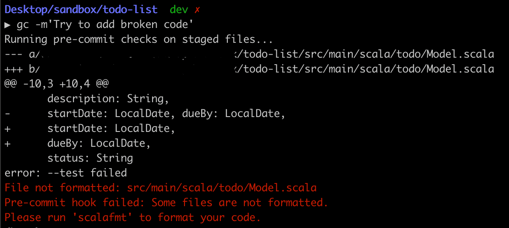

# Linter exploration

_An exploratory repo to study how to combine CI and git hooks to ensure an always-linted repository_.

## Setup

Before starting to contribute, run `./setup.sh`. This will **change** the default git hooks for this repository to check for linting before running a commit.
If no linted Scala files are found, an error message is shown, requiring the user to fix the issues before proceeding. We have chosen not to automatically lint the files to keep users with full control over the repository.
Just to let you know, only staged Scala files are checked.

If you are in a hurry or if you know the code is already properly linted, it's possible to bypass the hook with:

```bash
git commit --no-verify -m "Your commit message"
```

Please remember that the first step on the CI is linting, so it will make sure no broken code can be merged.

## Consequences

Trying to commit a non-linted file will produce the following output:



### Pros
- Easy to configure
- Full flexibility and control
- As the hook scripts live in a version-controlled directory, eventual (rare) changes will be incorporated locally transparently.

### Cons
- May disrupt users' workflow if they rely on git hooks
- Requires users to run `./setup.sh` right after cloning the repository

### Competing solutions

- [Pre-commit](https://pre-commit.com/):  A framework for managing and maintaining multi-language pre-commit hooks. Despite being language-agnostic, it requires a Python installation to run.
- [Husky](https://github.com/typicode/husky): A JavaScript framework for managing git hooks.
- [sbt-git-hooks](https://github.com/AbsaOSS/sbt-git-hooks): Similar to Husky, it allows keeping git hooks as part of a SBT project. The downside is that it creates a dependency between git and sbt (which may be slow to start up in larger projects).

## Linter information

This repository uses `scalafmt`, which can be easily configured to lint files on save on IntelliJ and VSCode.
Global Scalafmt configurations (irrespective of IDE) can be set by modifying `.scalafmt.conf`.

## Setting up this in another repository

1. Decide the linting tool you want to use. Here we use [scalafmt](https://scalameta.org/scalafmt/) and store its linting configs [here](./.scalafmt.conf). Once the linter is set up locally, this ensures all users are formatting the code in the same way.
2. Configure a CI step to check if the code is properly linted. It will work as a safeguard should users bypass the git hooks. This repository does so through GitHub Actions, so the configuration is available on [.github/workflows/scala.yml](.github/workflows/scala.yml).
3. Create a linting script on a git-tracked folder. In this case, we use [.githooks](.githooks/). Despite holding the hook scripts, the directory is not readily integrated with git and there's no standard naming for it. In this case, we're concerned with pre-commit hooks. If you think linting at every commit is too much, it's possible to change the script name from `pre-commit` to `pre-push` and run the check before every push instead. By default, all possible hooks are available on any Git repository on `.git/hooks`. Feel free to take a look and inspire yourself.
4. Include [setup.sh](./setup.sh) in the repository and educate users to run it the first time before starting to contribute to the repository. This script will change the current repo's hook folder from `./git/hooks` to `./githooks`. This may be a bit inconvenient if contributors use custom git hooks.
5. Now, whenever a user makes a commit to the local repository, the pre-commit hook will invoke `scalafmt` with the configs from [scalafmt.conf](./.scalafmt.conf) to check if the code being committed is linted. If not, an error message is displayed and the commit is aborted. This gives the user an opportunity to lint the code by themselves, without polluting the git history with lint-only commits. Also, it doesn't steal user's control to change their code unwillingly.
6. If users don't set up the workflow or bypass the hook (see above), the CI step will work as a safeguard to ensure non-linted code doesn't get merged into the main branch.
    - Recall protecting the merge of non-linted code into `main` requires an extra setup to require only branches with passing lint step can get merged.
